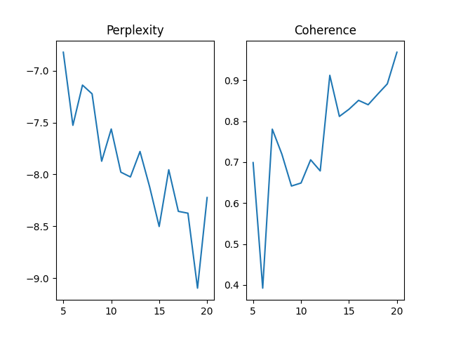

# Alternative_Topic-Modeling_Methods

### Brief Introduction ###
**Topic modeling** is a machine learning and natural language processing technique for determining the topics present in a document. It’s capable of determining the probability of a word or phrase belonging to a certain topic and cluster documents based on their similarity or closeness. It does this by analyzing the frequency of words and phrases in the documents.

Specifically, the current methods for extraction of topic models include Latent Dirichlet Allocation (LDA), Latent Semantic Analysis (LSA), Probabilistic Latent Semantic Analysis (PLSA), and Non-Negative Matrix Factorization (NMF).

**Latent Dirichlet Allocation (LDA)**

Latent Dirichlet Allocation is an unsupervised, machine learning, clustering technique that we commonly use for text analysis. It’s a type of topic modeling in which words are represented as topics, and documents are represented as a collection of these word topics.

In summary, this method recognizes topics in the documents through several steps:

* Sampling topics – initialize the Dirichlet distribution of documents in the topic’s space and choose N topics from multinomial distribution of topics over a document.
* Sampling words and creating a document – initialize the Dirichlet distribution of topics in the word’s space and choose N words, for each of the previously sampled topics, from the multinomial distribution of words over topics.
* Maximize the probability of creating the same documents.

**Perplexity Score**

There are a number of ways that can be used to analyze the performance of topic models. Most important,of which is perplexity, which is also used to find the number of topics by showing the generalization power of model on unseen data. It does not require a priori categorization, and was originally used in language modeling. It is used to estimate a model on a subset of a corpus and then the estimated model is used for prediction on an unseen or held out dataset.

**Coherence Score**

Coherence measures how “fitting” all top words are to a topic. The top words are the most frequently appearing words in a given topic, where frequency is calculated differently depending on the topic model. How “fitting” top words are together refer to how well they correlate with human judgment. A coherent topic could contain “brother, father, sister” because they cohere to family. An incoherent topic could contain “pizza, book, submarine” because their connection is unclear. Different coherent measures calculate these scores differently.

We can use the coherence score in topic modeling to measure how interpretable the topics are to humans. In this case, topics are represented as the top N words with the highest probability of belonging to that particular topic. Briefly, the coherence score measures how similar these words are to each other

---

## 1

- a) Evaluating coherence and perplexity values

  The `CoherenceTestIwor.py` program train the LDA model on the `TokenVieuxM.txt` dataset. After launch the program several times some observations can be made:

  * The **perplexity** value ranges between **-7.65** and **-6.99**.
  * The **coherence** value ranges between **0.32** and **0.45**.  
  
  The interpretation of what is considered a good or bad coherence value depends on the specific coherence measure used. In this case the **c_v coherence** measure is used, wich typically ranges between 0 and 1, with higher values indicating better coherence.

  This metrics creates content vectors of words using their co-occurrences and, after that, calculates the score using normalized pointwise mutual information (NPMI) and the cosine similarity. This metric is popular because it’s the default metric in the Gensim topic coherence pipeline module, but it has some issues. [Even the author of this metric doesn’t recommend using it](https://github.com/dice-group/Palmetto/issues/13#issuecomment-371553052).

  In general, coherence values above 0.4 are considered good, while values above 0.6 are considered very good. Values below 0.3 are considered poor, indicating that the topics are not coherent and may not be useful for interpretation or downstream applications.

  When evaluating the coherence of a set of topics, it's important to take into account the size of the dataset, the number of topics, and the quality of the text data.

  In the case of healthcare research paper abstracts, the coherence values of 0.3 and 0.4 for a 10-topic LDA model are reasonable, but not very high. It's possible that the abstracts are complex and difficult to model, or that the topics are too broad or overlapping.

  Regarding perplexity values we can say that values between -6.99 and -7.65 for a 10-topic LDA model may suggest that the model is performing reasonably well. Lower values of perplexity indicate better generalization power of the model on the words of test documents by the trained topics. However, perplexity is not always a perfect indicator of model quality. A model with low perplexity may not necessarily produce coherent topics that are useful for downstream applications. Additionally, perplexity values are often dependent on the size of the dataset and the complexity of the text data. 

  **Choosing the Best Coherence and Perplexity Scores**

  In order to obtain the best results regarding coherence and perplexity it may be helpful to experiment with different preprocessing techniques, such as stemming or stopword removal, or to adjust the hyperparameters of the LDA model, such as the number of topics or the alpha and beta hyperparameters.

  Usually, the coherence score will increase with the increase in the number of topics. This increase will become smaller as the number of topics gets higher. The trade-off between the number of topics and coherence score can be achieved using the so-called **elbow technique**. The method implies plotting coherence score as a function of the number of topics. We use the elbow of the curve to select the number of topics.
  The idea behind this method is that we want to choose a point after which the diminishing increase of coherence score is no longer worth the additional increase of the number of topics
  Also, the coherence score depends on the LDA hyperparameters, such as $\alpha$, $\beta$, and $K$. Because of that, we can use any machine learning hyperparameter tuning technique. After all, it’s important to manually validate results because, in general, the validation of unsupervised machine learning systems is always a tricky task.

  Generally, increasing the number of topics will improve the coherence but worsen the perplexity, so we need to find a balance that fits our needs and preferences. 

- b) Evaluating an specific launch

  One of the program outputs obtained is presented in the file `single_output.txt`. In this case just one or two words per topic are related to research on healthcare. Most of the words are stopwords and we can observe that they are repeated in the majority of the topics. In general, there seem to be some topics that could be relevant to healthcare, but there are also topics that appear less distinctive and more generic.

  Although the obtained perplexity value (-7.179193910071468) is low and the coherence value is above 0.3, the results are not good, since the words at the top of the topics are not representative of the general topic discussed in the documents.

----

## 2

- a) Stopwords are commonly used words in a language that are considered to have little or no **semantic** meaning when used in a text. These words are often removed from a text before any analysis is performed, as they do not carry important information about the meaning of the text and can unnecessarily increase the processing time of the analysis.  

  In natural language processing (NLP), stopwords are typically defined as a predefined set of words. The specific list of stopwords can vary depending on the application and the language being used, but the basic idea is to remove words that are so common and uninformative that they are unlikely to contribute to the meaning of the text. This process can be useful for tasks such as text classification, sentiment analysis, and topic modeling, where the goal is to extract meaningful information from the text while ignoring noise and irrelevant words.

- b) The main content of topics obtained in the results consists predominantly of stopwords. In this case, the topics identified aren't very informative or meaningful because they consist of generic and unimportant terms that are not specific to the dataset or corpus being analyzed.  

  When these words are not removed from the text prior to analysis, they can dominate the results and obscure more meaningful content. This is because the frequency of occurrence of stopwords are very high, which can cause them to appear in many of the identified topics, even if they are not particularly relevant to the underlying themes or patterns in the text.  

  Therefore, to obtain meaningful topics in the results, it is important to preprocess the text by removing stopwords and other irrelevant or redundant words. This can be achieved using techniques such as tokenization, stemming, and lemmatization, which can help to reduce the text to its most essential and informative components. By removing stopwords and other irrelevant terms, the resulting topics will be more specific and relevant to the dataset or corpus being analyzed, and will provide more meaningful insights into the underlying patterns and themes in the text.  

  It can help to improve the accuracy and relevance of the results, as the focus is shifted to the more meaningful and informative content. However, it is also important to note that the removal of stopwords can also lead to some loss of context or nuance, as these words can sometimes help to provide important **contextual information**. 

- c) For reasons of faster access, the stopwords are saved as a set in a variable and the line where the Potential ill-characters cleaning ends should be uncommented, since at this point the topics of the text to be analyzed are saved, and it is important just save the relevant ones.

  The `CoherenceTestIwor_sw_free.py` modified program train the LDA model on the `TokenVieuxM.txt` dataset with the stopwords removal function. After launch the program several times some observations can be made:

  * The **perplexity** value ranges between **-7.62** and **-7.08**.
  * The **coherence** value ranges between **0.69** and **0.85**.
  
  One of the program outputs obtained is presented in the file `single_output_sw_removed.txt`.
  
  The coherence score and perplexity score are two common metrics used to evaluate the quality of topic models. A coherence score of 0.80 indicates that the topics generated by the model are relatively coherent and have a good level of semantic similarity between the words that make up the topics. This suggests that the model is able to identify meaningful patterns and themes within the text.

  On the other hand, a perplexity score of -7.62 indicates that the model is able to generate new text that is highly similar to the original text. This suggests that the model is able to capture the underlying patterns and themes in the text, and is able to generate new text that is consistent with these patterns.

  The fact that the topics are of good quality and do not consist of stopwords suggests that the model is able to identify the most relevant and informative content in the text, and is able to capture the underlying patterns and themes that are specific to the dataset or corpus being analyzed. This is important because it indicates that the model is able to provide meaningful insights into the data and can be used to extract valuable information from the text.

  Better results are obtained than in the evaluation of question 1b), which indicates that the extraction of stopwords was a substantial improvement to the model.

- d) It can be observed that when running the program several times for `TokenVieuxM.txt` with expected topics ranging from 5 to 20, we obtain data such as:
  
  

  We can notice that coherence is at its highest value for the expected topic count of 18, and perplexity is at its lowest value which is generally what is sought. Therefore, we can conclude that within the searched range, the best expected topic count is 18.
  
- e) It can be observed that when running the program using `TokenVieuxN.txt` for an expected topic count of 10, without removing the stopwords, we obtain an approximate coherence of `0.3144`, whereas by removing the stopwords we obtain a coherence of approximately `0.5781`, indicating that removing the stopwords always improves the coherence of the model.

- f) Although coherence also tends to increase according to the expected topic count, it can be observed that it varies differently in `TokenVieuxN.txt`, so it can be concluded that the optimal number of topics depends on the data.

  

----

## 3
As a result of taking into account the proportion of topics in documents, in one of the program's runs it was found that out of a total of 8 topics:

### Typical Document for each topic, topic proportion (or probability) in documents 
Topic 0: Document 0 with prob: 0.9937055706977844

Topic 5: Document 1 with prob: 0.9942291975021362

Topic 1: Document 2 with prob: 0.9933327436447144

Topic 3: Document 3 with prob: 0.7552105784416199   

Topic 4: Document 3 with prob: 0.2414269596338272

Topic 8: Document 4 with prob: 0.9957541227340698

### Typical Document for each topic, measuring cosine similarity
In the case of measuring cosine similarity, it found that the cosine similarity was 1 for each document with all topics. Therefore, any document can be chosen to represent any of the topics.
